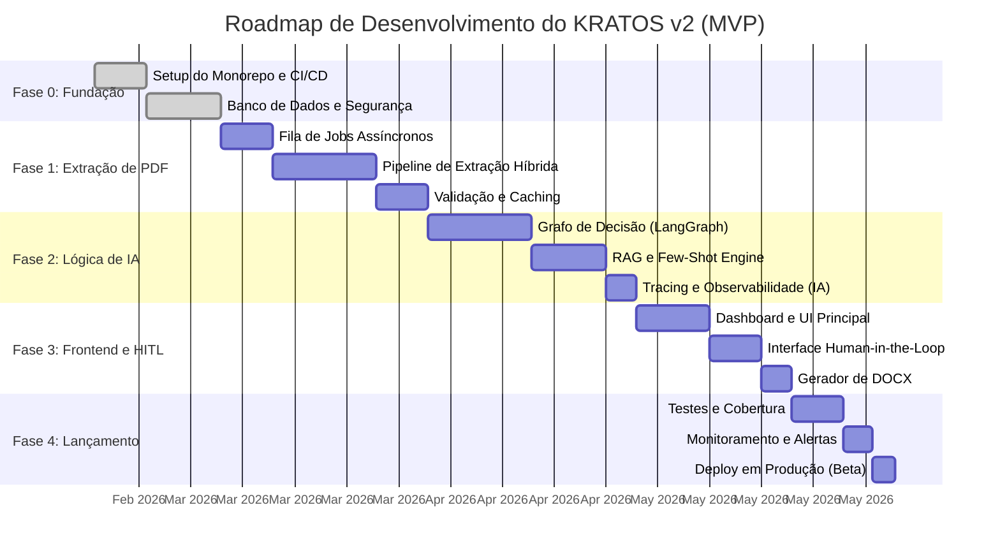

# Roadmap de Desenvolvimento — KRATOS v2

Este documento detalha o roadmap de desenvolvimento para o **KRATOS v2**, desde a fundação da infraestrutura até o lançamento do MVP (Minimum Viable Product) e as futuras evoluções para a versão Enterprise. O cronograma total para o MVP é estimado em **12 a 16 semanas**.

---

## Visão Geral do Roadmap (MVP)

A timeline abaixo apresenta uma visão geral das fases de desenvolvimento do MVP, com suas durações estimadas.

---

## Detalhamento das Fases

### Fase 0: Fundação, Segurança e CI/CD (2-3 semanas)

**Objetivo**: Estabelecer uma base de infraestrutura segura, automatizada e escalável, pronta para o desenvolvimento.

| Key Result | Tarefas Associadas |
| :--- | :--- |
| **KR1**: Ambiente de desenvolvimento 100% conteinerizado e reprodutível. | Setup do monorepo com pnpm e Turborepo; Configuração de Docker Compose para serviços locais (Redis). |
| **KR2**: Banco de dados PostgreSQL configurado com schema inicial e auditoria. | Criação do cluster no Supabase; Definição do schema (tabelas, colunas); Implementação de triggers SQL para logs imutáveis. |
| **KR3**: Pipeline de CI/CD funcional para staging. | Criação de workflows no GitHub Actions para lint, testes e deploy automático em ambiente de staging. |
| **KR4**: Gestão de segredos documentada. | Definição de todas as variáveis de ambiente necessárias e configuração no ambiente de staging. |

### Fase 1: Motor de Ingestão e Extração de PDF (3-4 semanas)

**Objetivo**: Construir um pipeline assíncrono e performático para processar PDFs e extrair conteúdo estruturado com alta precisão.

| Key Result | Tarefas Associadas |
| :--- | :--- |
| **KR1**: Processamento de PDFs é 100% assíncrono. | Implementação da fila de jobs com Celery e Redis; API principal responde imediatamente ao upload. |
| **KR2**: Acurácia de extração de tabelas >95% em documentos de teste. | Desenvolvimento do pipeline híbrido com Docling, pdfplumber e Gemini 2.5 Flash. |
| **KR3**: Todos os outputs extraídos são validados estruturalmente. | Implementação de schemas Pydantic rigorosos para cada tipo de extração. |
| **KR4**: Tempo de reprocessamento de documentos idênticos é zero. | Implementação de caching inteligente no Redis baseado no hash do conteúdo do PDF. |

### Fase 2: Orquestração de Agentes e Lógica de IA (3-4 semanas)

**Objetivo**: Implementar o núcleo inteligente do KRATOS, capaz de analisar o conteúdo extraído, aplicar frameworks jurídicos e gerar minutas.

| Key Result | Tarefas Associadas |
| :--- | :--- |
| **KR1**: Fluxo de agentes de IA totalmente modelado e executável. | Implementação do grafo de decisão no LangGraph (Supervisor, Roteador, Especialista). |
| **KR2**: Sistema RAG funcional, recuperando precedentes relevantes. | Indexação de documentos de teste no `pgvector`; Implementação da lógica de busca de similaridade e injeção de few-shots. |
| **KR3**: Roteamento de modelos de IA otimiza custo e performance. | Implementação do Supervisor de Complexidade para escolher entre Gemini 2.5 Flash, Claude Sonnet 4 e Claude Opus 4. |
| **KR4**: 100% das decisões de IA são rastreáveis e auditáveis. | Integração completa com LangSmith; Persistência do Chain-of-Thought no banco de dados. |

### Fase 3: Frontend, HITL e Geração de Documentos (2-3 semanas)

**Objetivo**: Criar uma interface de usuário intuitiva, o fluxo de validação humana e a funcionalidade de exportação de documentos.

| Key Result | Tarefas Associadas |
| :--- | :--- |
| **KR1**: Usuário pode fazer upload de um PDF e visualizar o status do processamento. | Desenvolvimento do dashboard principal com Bento Grid e a tela de upload. |
| **KR2**: Advogado pode revisar, editar e aprovar 100% do conteúdo gerado pela IA. | Criação da interface Human-in-the-Loop com diff-viewer e painel de raciocínio. |
| **KR3**: Minutas aprovadas podem ser exportadas para `.docx` com um clique. | Desenvolvimento do endpoint de geração de documentos com `docxtpl`. |
| **KR4**: Interface atinge pontuação >90 em Acessibilidade no Lighthouse. | Implementação de ARIA labels, modo escuro com OKLCH e design responsivo. |

### Fase 4: Testes, Monitoramento e Deploy (2 semanas)

**Objetivo**: Garantir a qualidade, a estabilidade e a observabilidade da aplicação para o lançamento em beta.

| Key Result | Tarefas Associadas |
| :--- | :--- |
| **KR1**: Cobertura de testes >80% para fluxos críticos. | Implementação de testes unitários (Pytest, Vitest) e de integração (Playwright). |
| **KR2**: Sistema de alertas notifica a equipe sobre falhas críticas em menos de 5 minutos. | Configuração de Sentry para error tracking e Prometheus/Grafana para métricas de performance. |
| **KR3**: Aplicação deployada em produção e acessível para usuários beta. | Configuração dos ambientes de produção (Vercel, Fly.io); Execução do deploy final. |
| **KR4**: SLA de processamento (95% dos PDFs em < 30s) é monitorado. | Criação de dashboards no Grafana para acompanhar os principais indicadores de performance. |

---

## Roadmap Pós-MVP (Enterprise)

Após a validação do MVP com o grupo beta, o KRATOS evoluirá para uma solução enterprise com as seguintes melhorias planejadas:

| Versão | Feature | Descrição |
| :--- | :--- | :--- |
| **v2.1** | **Migração para TiDB** | Quando o volume de dados justificar, migrar de PostgreSQL para TiDB Cloud com Vector Search nativo para escalabilidade horizontal. |
| **v2.2** | **Infisical para SecretOps** | Adotar Infisical com Machine Identities para rotação automática de segredos em múltiplos ambientes. |
| **v2.3** | **Kestra para Workflows Externos** | Integrar Kestra para orquestrar workflows que envolvam APIs de tribunais, sistemas de protocolo e notificações. |
| **v2.4** | **Fine-tuning de Modelos Open-Source** | Treinar modelos como Qwen ou Llama em datasets jurídicos brasileiros para reduzir dependência de APIs pagas e aumentar a especialização. |
| **v3.0** | **Kubernetes e Multi-tenancy** | Migrar de PaaS para Kubernetes para controle total sobre scaling e resiliência, e adicionar suporte a múltiplos escritórios com isolamento de dados. |
